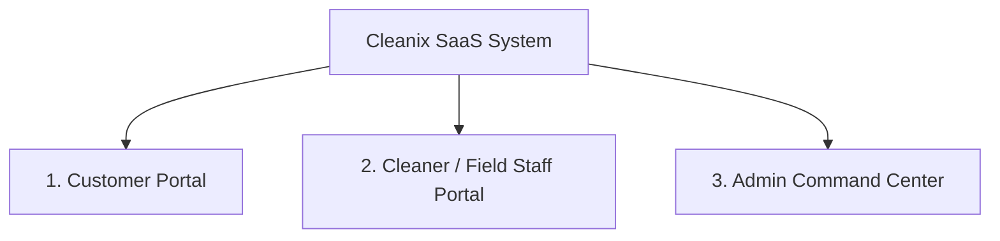

# 🧼 Cleanix - Full-Stack SaaS Platform
## Software Requirement Specification (SRS) & Production Roadmap

---

## 📌 ১. এক্সিকিউটিভ সামারি ও ব্যবসায়িক ধারণা (Executive Summary & Core Concept)

**Cleanix** হলো একটি অন-ডিমান্ড **B2B (Business-to-Business)** এবং **B2C (Business-to-Consumer)** হাইব্রিড ক্লিনিং সার্ভিস অটোমেশন প্ল্যাটফর্ম। এটি বাসা-বাড়ি, কমার্শিয়াল অফিস, রেনোভেশন সাইট এবং রিলোকেশন স্পেসের জন্য বিশ্বস্ত, দ্রুত এবং মানসম্পন্ন পরিচ্ছন্নতা সেবা নিশ্চিত করে। 

প্ল্যাটফর্মটি সাধারণ কোনো বুকিং সাইট নয়; এটি একটি সম্পূর্ণ **SaaS (Software-as-a-Service)** চালিত ফিল্ড সার্ভিস ম্যানেজমেন্ট ইকোসিস্টেম, যেখানে কাস্টমার, সার্ভিস প্রোভাইডার (ক্লিনার টিম) এবং এডমিনের ইন্টারঅ্যাকশন সম্পূর্ণ স্বয়ংক্রিয়ভাবে পরিচালিত হয়।

---

## 🎯 ২. টার্গেট অডিয়েন্স ও রাজস্ব মডেল (Target Audience & Revenue Model)

### 👥 টার্গেট কাস্টমার (Target Audience)
1. **আবাসিক গ্রাহক (B2C):** ব্যস্ত পেশাজীবী ও পরিবার, যাদের নিয়মিত বাড়ি পরিষ্কার বা ডিপ ক্লিনিং প্রয়োজন।
2. **কমার্শিয়াল গ্রাহক (B2B):** কর্পোরেট অফিস, শোরুম, রেস্তোরাঁ ও ব্যবসা প্রতিষ্ঠান যাদের দৈনিক/সাপ্তাহিক রুটিন কাস্টম ক্লিনিং প্রয়োজন।
3. **স্থানান্তরকারী গ্রাহক (Move-in / Move-out):** নতুন বাসায় উঠছেন বা পুরোনো বাসা ছাড়ছেন এমন বাসা/অফিস মালিক।
4. **কনস্ট্রাকশন ও রেনোভেশন ওনার (Post-Construction):** নতুন বিল্ডিং বা রেনোভেশন শেষের পর স্পেস পুরোপুরি ব্যবহারের উপযোগী করতে ইচ্ছুক গ্রাহক।

### 💰 রেভিনিউ মডেল (Revenue Generation Streams)
1. **মান্থলি ও ইয়ার্লি সাবস্ক্রিপশন প্যাকেজ (Recurring Subscriptions):**
   - **Basic Plan ($199/মাস):** স্ট্যান্ডার্ড হোম ক্লিনিং, কিচেন ও বাথ রিফ্রেশ, ইমেইল সাপোর্ট।
   - **Standard Plan ($499/মাস):** প্রায়োরিটি ডিপ ক্লিনিং, স্যানিটাইজিং, ২৪/৭ সাপোর্ট, মাল্টি-রুম প্যাক।
   - **Premium Plan ($899/মাস):** মাস্টার কমার্শিয়াল ও হোম ক্লিন, ডেডিকেটেড কনসিয়ার্জ, রিয়েল-টাইম ট্র্যাকিং।
2. **কাস্টম ইনস্ট্যান্ট এস্টিমেট (Instant One-Time Booking):** স্পেসের সাইজ (Square Feet), রুম সংখ্যা এবং অ্যাড-অন সেবার ওপর ভিত্তি করে ডাইনামিক পে-পার-সার্ভিস বিলিং।
3. **অ্যাড-অন সার্ভিস ফি (Add-on Charges):** ওভেন ওয়াশ, ফ্রিজ ডিপ ক্লিন, ইন্টারিয়র উইন্ডো ক্লিনিং, ক্যাট/পেট হাইজিন ট্রিটমেন্ট।

---

## 🏗️ ৩. সিস্টেম আর্কিটেকচার ও টেকনোলজি স্ট্যাক (System Architecture & Tech Stack)

| লেয়ার (Layer) | প্রযুক্তি (Technology) | বিবরণ (Description) |
| :--- | :--- | :--- |
| **Frontend Framework** | **Next.js 16 (App Router)** | Server Components, Turbopack, Fast Refresh |
| **Styling & UI** | **Tailwind CSS + Framer Motion** | Glassmorphism, Lenis Smooth Scroll, Responsive UI |
| **Database** | **PostgreSQL (Supabase / Neon)** | Relational Data Integrity, ACID Compliant |
| **ORM Layer** | **Prisma ORM** | Type-safe DB Client & Migrations |
| **Authentication** | **NextAuth.js (Auth.js) / Clerk** | OAuth (Google), Email Magic Link, RBAC Credentials |
| **Payment Engine** | **Stripe API** | Subscriptions, Payment Intents, Webhooks |
| **Media & Storage** | **Uploadthing / Cloudinary** | Before/After Photo Uploads |
| **Communication API** | **Resend + Twilio** | Transactional Emails & SMS Notifications |

---

## 🔐 ৪. রুল-বেসড অ্যাক্সেস কন্ট্রোল (Role-Based Access Control - RBAC)



### 👤 ১. কাস্টমার রোল (Customer Role)
- সার্ভিস ক্যাটাগরি, স্পেস সাইজ ও সময় নির্বাচন করে ইনস্ট্যান্ট বুকিং দেওয়া।
- ক্রেডিট কার্ড বা অনলাইন পেমেন্ট এবং সাবস্ক্রিপশন প্ল্যান অ্যাক্টিভেট করা।
- ড্যাশবোর্ডে সার্ভিসের স্ট্যাটাস (Scheduled, Assigned, En Route, Completed) লাইভ দেখা।
- অতীত কাজের সার্ভিস ইনভয়েস ডাউনলোড করা এবং রিভিউ/রেটিং প্রদান করা।

### 🧹 ২. ক্লিনার / ফিল্ড স্টাফ রোল (Cleaner / Staff Role)
- দৈনিক এসাইন হওয়া কাজের তালিকা ও সময়সূচি দেখা।
- গুগল ম্যাপস (Google Maps) ডিরেকশনসহ কাজের লোকেশন ও ক্লায়েন্ট নোট দেখা।
- কাজের বর্তমান অবস্থা সিলেক্ট করা (Check-in, In Progress, Completed)।
- কাজের সত্যতা ও কোয়ালিটি প্রমাণের জন্য **Before & After Photos** আপলোড করা।

### 🛡️ ৩. এডমিন ও ডিসপ্যাচার রোল (Admin / Dispatcher Role)
- **Visual Schedule Calendar:** সম্পূর্ণ টিমের জন্য কাজ বরাদ্দ বা পরিবর্তন (Re-assign) করা।
- **Dynamic Pricing Engine:** সার্ভিস ফি, সাবস্ক্রিপশন চার্জ ও ডিসকাউন্ট কুপন পরিবর্তন করা।
- **CRM & User Management:** কাস্টমার ইনফরমেশন ও সাবস্ক্রিপশন স্ট্যাটাস তদারকি করা।
- **Financial Analytics Dashboard:** দৈনিক আয়, মোট বুকিং, স্টাফ পেমেন্ট ও পে-আউট সামারি।

---

## ⚙️ ৫. কোর ফাংশনাল রিকোয়ারমেন্টস (Core Functional Requirements)

### 1. ইনস্ট্যান্ট বুকিং ও ডাইনামিক প্রাইস ক্যালকুলেটর ইঞ্জিন
- কাস্টমার টাইপ (Home / Office) এবং রুম/বাথরুম সংখ্যা সিলেক্ট করবে।
- রিয়েল-টাইমে অ্যালগরিদমের মাধ্যমে মোট বিল ও আনুমানিক সময় গণনা হবে।
- ইন্টারেক্টিভ কেলেন্ডারে ফাঁকা স্লট (Time Slot) বেছে নেওয়ার সুবিধা।

### 2. সাবস্ক্রিপশন ও বিলিং ইঞ্জিন (Stripe Integration)
- সাবস্ক্রিপশন প্ল্যান প্রতি মাসে স্বয়ংক্রিয়ভাবে বিলিং সম্পন্ন করবে।
- ব্যর্থ পেমেন্টের ক্ষেত্রে অটোমেটিক রিকভারি ইমেইল ও রিমাইন্ডার পাঠানো।

### 3. স্মার্ট ডিসপ্যাচ ও ক্লিনার এলোকেশন সিস্টেম
- নতুন বুকিং আসলে কাস্টমারের নিকটস্থ এভেলেবল ক্লিনার টিমকে নোটিফিকেশন পাঠানো।
- এডমিন চাইলে যেকোনো কাজের সময় বা ক্লিনার ম্যানুয়ালি পরিবর্তন করতে পারবে।

### 4. প্রুফ অফ ওয়ার্ক ও কোয়ালিটি কন্ট্রোল (Proof of Work)
- ক্লিনার কাজ শেষ করার সাথে সাথে ছবি তুলে আপলোড করবে।
- কাস্টমার নোটিফিকেশন পাবে এবং ছবি দেখে ডিজিটাল সিগনেচার বা রেটিং প্রদান করতে পারবে।

---

## 🗄️ ৬. ডাটাবেজ স্কিমা ডিজাইন (Database Schema Models)

```prisma
// User Model (Customer, Cleaner, Admin)
model User {
  id            String      @id @default(cuid())
  name          String
  email         String      @unique
  password      String?
  role          Role        @default(CUSTOMER)
  phone         String?
  address       String?
  createdAt     DateTime    @default(now())
  updatedAt     DateTime    @updatedAt
  bookings      Booking[]   @relation("CustomerBookings")
  jobs          Booking[]   @relation("CleanerJobs")
  subscriptions Subscription[]
  reviews       Review[]
}

enum Role {
  CUSTOMER
  CLEANER
  ADMIN
}

// Service Model
model Service {
  id          String   @id @default(cuid())
  title       String
  slug        String   @unique
  basePrice   Float
  description String
  category    String
  bookings    Booking[]
}

// Booking Model
model Booking {
  id            String        @id @default(cuid())
  bookingNumber String        @unique
  customerId    String
  customer      User          @relation("CustomerBookings", fields: [customerId], references: [id])
  cleanerId     String?
  cleaner       User?         @relation("CleanerJobs", fields: [cleanerId], references: [id])
  serviceId     String
  service       Service       @field(fields: [serviceId], references: [id])
  status        BookingStatus @default(PENDING)
  totalAmount   Float
  scheduledAt   DateTime
  address       String
  beforePhotos  String[]
  afterPhotos   String[]
  paymentStatus PaymentStatus @default(UNPAID)
  createdAt     DateTime      @default(now())
}

enum BookingStatus {
  PENDING
  CONFIRMED
  EN_ROUTE
  IN_PROGRESS
  COMPLETED
  CANCELLED
}

enum PaymentStatus {
  UNPAID
  PAID
  REFUNDED
}

// Subscription Model
model Subscription {
  id         String   @id @default(cuid())
  userId     String
  user       User     @relation(fields: [userId], references: [id])
  stripeSubId String  @unique
  planName   String
  price      Float
  status     String
  startDate  DateTime
  endDate    DateTime
}

// Review Model
model Review {
  id        String   @id @default(cuid())
  userId    String
  user      User     @relation(fields: [userId], references: [id])
  rating    Int
  comment   String
  createdAt DateTime @default(now())
}
```

---

## 🗓️ ৭. প্রজেক্ট ডেভেলপমেন্ট রোডম্যাপ (Development Implementation Phases)

### 🔹 Phase 1: Database & Auth Setup (Week 1)
- Prisma ORM এবং PostgreSQL কানেক্টিভিটি সম্পন্ন করা।
- NextAuth.js দিয়ে কাস্টমার, ক্লিনার ও এডমিন রোল-বেসড লগইন/রেজিস্ট্রেশন তৈরি।

### 🔹 Phase 2: Booking Engine & Pricing Logic (Week 2)
- ডাইনামিক প্রাইস ক্যালকুলেটর উইজেট ও স্লট সিলেকশন লজিক তৈরি।
- Stripe Payment Gateway ও Checkout API কানেক্ট করা।

### 🔹 Phase 3: Customer & Staff Portals (Week 3)
- কাস্টমার বুকিং ড্যাশবোর্ড ও সার্ভিস ট্র্যাকিং তৈরি।
- ফিল্ড স্টাফের জন্য মোবাইল-ফ্রেন্ডলি জব ড্যাশবোর্ড ও ফটো আপলোড সুবিধা যোগ করা।

### 🔹 Phase 4: Admin Control Center & Final Testing (Week 4)
- ভিজ্যুয়াল বুকিং ক্যালেন্ডার, ডিসপ্যাচ সিস্টেম ও সিআরএম অ্যানালিটিক্স সম্পূর্ণ করা।
- এন্ড-টু-এন্ড কোয়ালিটি অ্যাসিওরেন্স (QA) টেস্ট ও সার্ভার ডিপ্লয়মেন্ট (Vercel / Railway)।

---

## 🎯 সারসংক্ষেপ (Conclusion)

এই **Software Requirement Specification (SRS)** অনুসরণের মাধ্যমে **Cleanix** ফ্রন্টএন্ড প্রজেক্টটিকে একটি অত্যন্ত লাভজনক, স্কেলেবল এবং প্রফেশনাল **Full-Stack Cleaning SaaS Ecosystem**-এ রূপান্তর করা সম্ভব।
